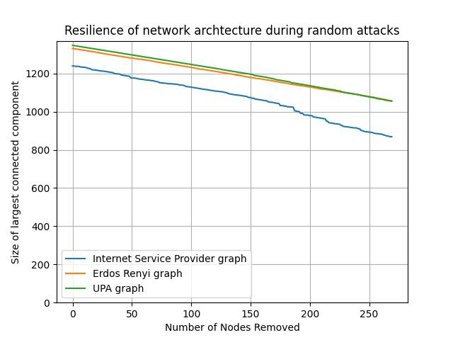
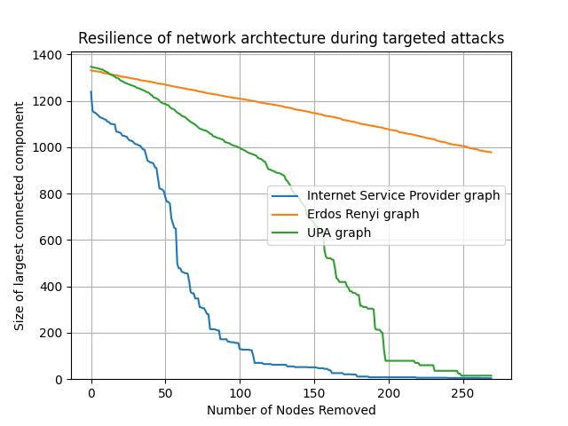

# Network Graph Resilience under Random and Targeted Attacks

This project investigates the effects of random and targeted attacks on two network architectures: Erdos-Renyi (ER) and Uniform Preferential Attachment (UPA). Both graphs were created with approximately the same number of nodes and edges. ER accumulates edges on nodes that already have more connections, while UPA maintains a constant probability of edge existence between any two nodes. Additionally, the study includes a comparison of the network architecture of an ISP provider with the randomly generated graphs.

## Results

### Random Attacks

Under the random attack scenario, the largest connected component sizes of all three graphs decreased approximately linearly as more nodes were deleted from the graphs. The largest connected component sizes of all the graphs decreased at roughly the same rate. Since the average number of edges in each graph is roughly the same, by randomly picking nodes to remove, the number of edges that are removed each time is roughly constant. In this scenario, the resilience of all three graphs is roughly equivalent.

### Targeted Attacks

Under the targeted attack scenario, the largest connected component size of the ER graph decreased approximately linearly, however, that of the UPA graph decreased at a faster rate as more nodes were removed. This difference in network resilience is expected since the UPA model generates graphs by preferring to add more edges to nodes that already have more edges, while the ER model randomly generates edges between pairs of nodes based on a constant probability of whether an edge is likely to appear. The ER graph evenly distributes its edges, so roughly the same number of edges are removed in every consecutive targeted attack. In contrast, the UPA graph will have some nodes that have accumulated significantly more connections than others and since the nodes with the most edges are removed first, far more edges are removed for every node that is removed (among the 20% of nodes that have the highest number of connections). The more edges are removed, the more likely connected components will be broken apart, thus the size of the largest connected component decreases faster for the UPA graph compared to ER. The largest connected component size of the ISP network decreases even faster than that of the UPA graph, indicating that there is an even higher concentration of edges amongst a few nodes in the Internet Service Provider graph than in the UPA graph. Therefore, the ER graph exhibits the highest resilience under targeted attack, followed by the UPA graph, and then the ISP graph.

## Conclusion

The results of this experiment show that the ISP network topology is poorly designed for targeted attacks, as a few attacks on the most connected nodes can easily break apart the network. If the ISP network were to be redesigned against targeted attacks, then the network should be more decentralized, with a smaller difference between the number of edges on the most and least connected node. This can be achieved by adding redundant connections between areas of the graph that are topologically far apart and connected by only a few intermediary nodes. However, this added redundancy may not always be financially feasible, since adding connections between nodes far apart apart would require more resources to build and maintain those connections.

